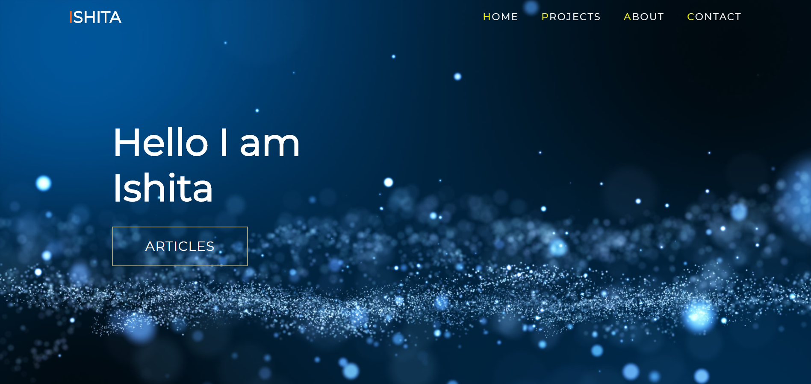
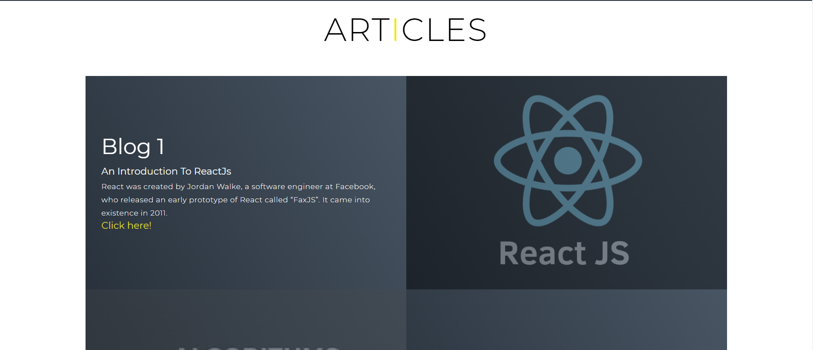
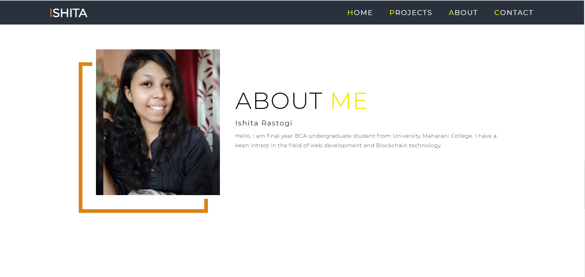
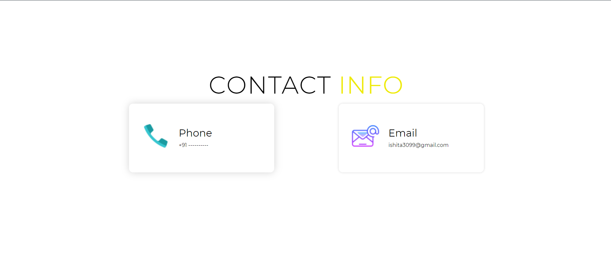

# Portfolio using HTML , CSS & JS

## About the Web Page
#### The Web Page contains the following Section

##### Front Section
  
This is the front section along with the header , header contains the internal anchor tag which takes you to the different section of the page.

##### Articles
  
  
  This is the article section of the page , where you can list your articles from external sources like medium.
 
##### Personal Profile
    
  This is the personal profile section , where you can add your picture and personal details about your self.
  
##### Contact Details
    
  This is the contact section of the page , where you can add you contact details like mobile and email 
  
##### Page footer
    
  This is the footer section of the page where you can add to external links for you social media handle.
  
  
#### For any query feel free to contact [Ishita Rastogi ](https://www.linkedin.com/in/ishitarastogii/)
